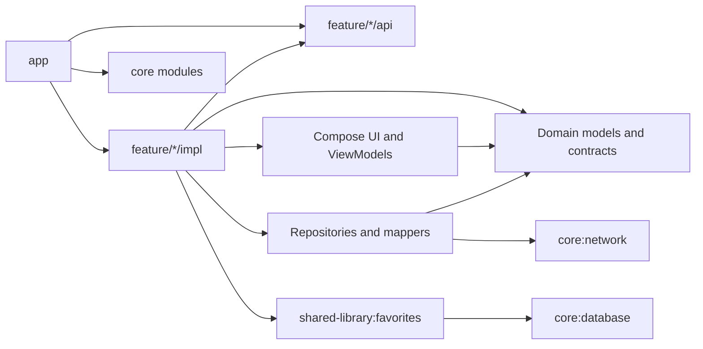

# StocksViewer Android

StocksViewer is a native Android application for browsing, searching, and saving stocks and ETFs. It displays company information and interactive candlestick charts using data from the Polygon/Massive API.

The application is built with Kotlin and Jetpack Compose. It uses a modular, feature-first architecture with Clean Architecture boundaries inside each feature, Hilt dependency injection, unidirectional state flow, and independent Navigation 3 back stacks.

## Features

- Paginated stock and ETF list
- Debounced stock search
- Pull-to-refresh and paging retry
- Company overview and market information
- Day, week, month, and quarter candlestick periods
- Reactive local favorites
- Light and dark system themes
- Independent navigation stacks for Stocks and Favorites

## Requirements

- Android Studio with Android SDK 36
- JDK 17
- Android device or emulator running API 28 or newer
- Polygon/Massive API key

The application compiles against SDK 36, targets SDK 36, and supports a minimum SDK of 28.

## Architecture

The project combines multi-module architecture with Clean Architecture inside feature implementation modules.



The main dependency rules are:

- `app` is the application composition root. It initializes Compose, Hilt, theming, top-level navigation, and feature entry builders.
- `feature:<name>:api` exposes navigation keys and stable cross-module contracts without exposing feature implementation details.
- `feature:<name>:impl` contains feature UI, ViewModels, state, domain models, repository contracts, repository implementations, mappers, and Hilt bindings.
- `shared-library:favorites` owns reusable favorite-domain and repository logic consumed by both Details and Favorites.
- `core` modules contain shared infrastructure, navigation, design-system components, resources, persistence, networking, and testing utilities.
- `build-logic` contains convention plugins that apply common Android, Kotlin, Compose, Hilt, Detekt, and JaCoCo configuration.

Repository implementations depend on domain repository interfaces. ViewModels consume repositories or use cases and expose immutable `StateFlow` state to Compose screens.

## Module structure

```text
StocksViewer/
├── app/                         Application, theme host, and navigation root
├── build-logic/                 Project convention plugins
├── core/
│   ├── common/                  Domain errors and shared mapping
│   ├── commonresources/         Shared strings and StringProvider
│   ├── database/                Room database, entities, and DAO
│   ├── designsystem/            Theme, icons, and reusable components
│   ├── navigation/              Navigation 3 state and Navigator
│   ├── network/                 Retrofit API, models, errors, and DI
│   ├── testing/                 Shared unit and Compose test dependencies
│   └── ui/                      Shared feature-level UI components
├── feature/
│   ├── list/
│   │   ├── api/                 StocksListKey
│   │   └── impl/                Paging, search, list UI, and repository
│   ├── details/
│   │   ├── api/                 StocksDetailKey
│   │   └── impl/                Overview, charts, favorite toggle, and UI
│   └── favorites/
│       ├── api/                 FavoritesListKey
│       └── impl/                Favorites state, mapping, and UI
├── shared-library/
│   └── favorites/               Shared favorites domain and repository
├── gradle/libs.versions.toml    Dependency and plugin version catalog
└── tools/detekt/                Static-analysis configuration
```

## Feature responsibilities

### Stocks list

The list feature uses Paging 3 with a cursor-based `PagingSource`. An empty query loads the full ticker list; a non-empty query calls the search endpoint. `StocksListViewModel` debounces query changes for one second, replaces previous searches with `flatMapLatest`, maps domain objects to UI models, and caches paging data in `viewModelScope`.

### Stock details

The details feature receives its ticker through an assisted-injected ViewModel. It loads the company overview, then requests a two-year candle window for the initially selected weekly period. Users can select day, week, month, or quarter periods and retry chart failures independently. The feature also observes and toggles favorite status through the shared favorites repository.

### Favorites

The favorites feature observes a Room-backed `Flow<List<FavoriteStock>>`. Its ViewModel maps database-backed domain models to immutable UI models and exposes loading, empty, and content states. Selecting a favorite navigates to the same details implementation used by the stocks list.

## State management

The application follows unidirectional data flow:

```text
Compose event → ViewModel → Repository or use case → Data source
Compose UI ← StateFlow ← ViewModel ← Domain result
```

- ViewModels run asynchronous work in `viewModelScope`.
- `MutableStateFlow` is private to each ViewModel.
- Screens collect read-only `StateFlow` values.
- UI collections use Kotlin immutable collections where stable list values are useful.
- Paging state is provided through Paging Compose rather than copied into feature state.

## Networking and errors

Remote requests follow this path:

```text
ViewModel → Repository contract → Repository implementation
          → StocksApi → Retrofit → OkHttp → Polygon/Massive API
```

The network module provides singleton Gson, OkHttp, and Retrofit instances through Hilt. An OkHttp interceptor appends the API key to every API request. HTTP body logging is enabled only for debug builds.

A custom Retrofit call adapter converts responses into `Either<ApiError, Value>`. Repository implementations map network errors into the shared `DomainError` hierarchy:

- `MissingNetworkConnection`
- `HttpError`
- `GeneralError`

Arrow `Either` keeps expected failures in the return type. UI-facing error text is resolved through the shared `ErrorMapper` and Android string resources.

## Persistence

Favorites are stored in a Room database named by `DatabaseModule`. The database currently contains one `favorite_stocks` table.

`FavoriteStockDao` provides:

- Alphabetically ordered favorite streams
- Reactive favorite-status checks by ticker
- Upsert operations
- Removal by ticker

Room `Flow` queries allow the Details and Favorites screens to update automatically after a favorite changes.

## Navigation

The application uses AndroidX Navigation 3 with serializable navigation keys.

Top-level routes:

- `StocksListKey`
- `FavoritesListKey`

Details use `StocksDetailKey`. Each top-level destination owns an independent back stack. `Navigator` switches tabs, avoids duplicate detail destinations, resets a tab when its selected item is tapped again, and integrates with the system back action. The bottom navigation bar is displayed only on top-level screens.

## Dependency injection

Hilt provides application-wide dependency composition:

- `@HiltAndroidApp` initializes the application component.
- `@AndroidEntryPoint` injects the main activity.
- `@HiltViewModel` constructs feature ViewModels.
- Hilt modules bind repository interfaces and provide Room and Retrofit infrastructure.
- Assisted injection supplies the ticker argument to `StockDetailsViewModel`.

## Libraries

### Application libraries

| Library | Usage |
| --- | --- |
| Jetpack Compose | Declarative UI, themes, layouts, and reusable components |
| Material 3 | Application design system, navigation bar, and components |
| AndroidX Lifecycle | ViewModels, lifecycle-aware state collection, and `viewModelScope` |
| AndroidX Navigation 3 | Typed navigation keys and independent top-level back stacks |
| Paging 3 | Cursor-based stock pagination, refresh, append, and retry state |
| Hilt | Dependency injection for infrastructure, repositories, and ViewModels |
| Kotlin Coroutines and Flow | Asynchronous requests, reactive state, and database streams |
| Retrofit | Typed Polygon/Massive API endpoints |
| OkHttp | HTTP transport, API-key interception, and debug logging |
| Gson | API response deserialization |
| Arrow | `Either` results for network and domain failures |
| Room | SQLite favorites persistence and reactive DAO queries |
| Coil | Company logo and icon loading in Compose |
| Vico | Candlestick chart rendering and markers |
| Kotlin Serialization | Serializable Navigation 3 route keys |
| Kotlin immutable collections | Stable immutable lists in Compose state |
| Timber | Debug application and HTTP logging |

Dependency and plugin versions are managed centrally in `gradle/libs.versions.toml`.

### Build and quality libraries

| Library | Usage |
| --- | --- |
| Kotlin Symbol Processing | Room and Hilt code generation |
| Detekt | Kotlin static analysis and formatting rules |
| JaCoCo | Unit and instrumentation test coverage reports |
| JUnit 4 | Local unit tests |
| AndroidX Test and Compose UI Test | Instrumented and Compose UI tests |
| MockK | Test doubles and interaction verification |
| Turbine | Kotlin Flow testing |
| Kotlin Coroutines Test | Deterministic coroutine scheduling |
| Paging Test | PagingSource and PagingData testing |
| Truth and Kluent | Test assertions |

## API configuration

The API key is injected into `core:network` through the Google Secrets Gradle Plugin. Keep real credentials in ignored local configuration and never commit them.

Add these values to the root `local.properties` file:

```properties
BACKEND_URL=https://api.polygon.io/
API_KEY=your_api_key
```

Android Studio normally creates `local.properties` with the Android SDK location. Preserve its existing `sdk.dir` entry when adding these values.

`secrets.defaults.properties` supplies fallback values when local properties are unavailable. It should contain safe placeholders rather than production credentials.

## Build and run

Open the `StocksViewer` directory in Android Studio, select the `app` run configuration, and choose an API 28 or newer device or emulator.

Command-line build:

```sh
./gradlew :app:assembleDebug
```

Install the debug build on a connected device:

```sh
./gradlew :app:installDebug
```

The generated APK is written under `app/build/outputs/apk/debug/`.

## Verification

Run all local unit tests:

```sh
./gradlew test
```

Run static analysis:

```sh
./gradlew detekt
```

Run instrumented and Compose UI tests on a connected device or emulator:

```sh
./gradlew connectedDebugAndroidTest
```

Generate combined debug coverage reports for modules configured with JaCoCo:

```sh
./gradlew createDebugCombinedCoverageReport
```

Coverage HTML and XML files are generated inside the corresponding module's `build/reports/jacoco/` directory.

## Release builds

Release builds enable code shrinking and resource shrinking with the optimized default ProGuard configuration. Configure a production signing key before distributing the application.
