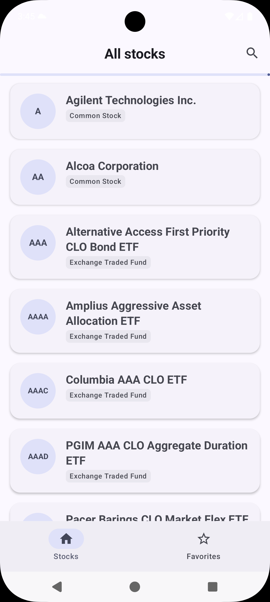
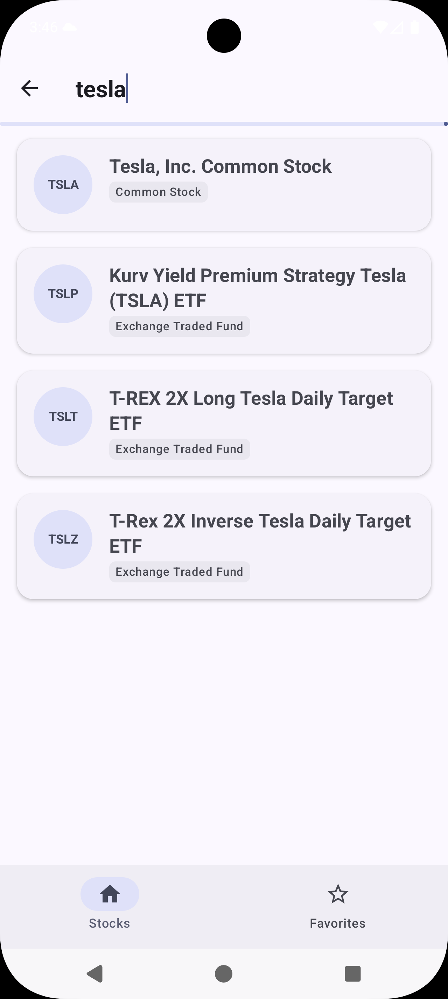
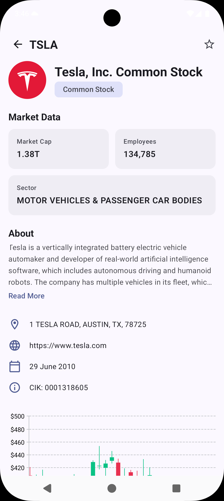
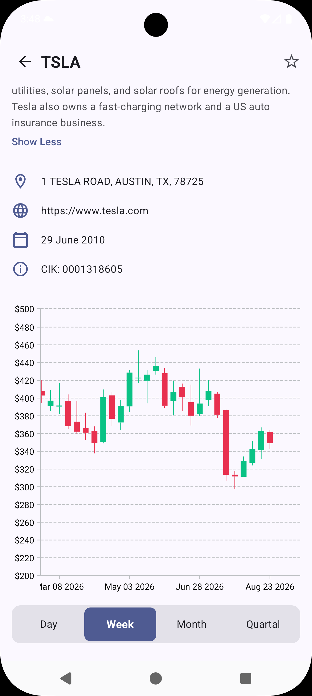

# StocksViewer Android

StocksViewer is a native Android application for browsing, searching, and saving stocks and ETFs. It displays company information and interactive candlestick charts using data from the Polygon/Massive API.

The application is built with Kotlin and Jetpack Compose. It uses a modular, feature-first architecture with Clean Architecture boundaries inside each feature, Hilt dependency injection, unidirectional state flow, and independent Navigation 3 back stacks.

## Other StocksViewer apps:
Compose Multiplatform Mobile(CMM) - Android and iOS share the same UI written in Compose:

https://github.com/DenisShov/StocksViewerCMP

Kotlin Multiplatform Mobile(KMM) - Android uses Compose and iOS uses SwiftUI for UI:

https://github.com/DenisShov/StocksViewerKMP 

Flutter:

https://github.com/DenisShov/StocksViewerFlutter

## Screenshots

<table>
  <tr>
    <td align="center"></td>
    <td align="center"></td>
    <td align="center"></td>
    <td align="center"></td>
  </tr>
  <tr>
    <td align="center">Start screen</td>
    <td align="center">Search</td>
    <td align="center">Details screen header</td>
    <td align="center">Details screen footer</td>
  </tr>
</table>

## Features

- Stocks/ETF list using Paging 3 library 
- Stocks search
- Company overview and market information
- Day, week, month, and quarter candlestick periods
- Favorites stored in room DB
- Independent navigation stacks for Stocks and Favorites using Navigation 3 library

## Architecture

The project combines multi-module architecture with Clean Architecture inside feature implementation modules.

The main dependency rules are:

- `app` is the application composition root. It initializes Compose, Hilt, theming, top-level navigation, and feature entry builders.
- `feature:<name>:api` exposes navigation keys and stable cross-module contracts without exposing feature implementation details.
- `feature:<name>:impl` contains feature UI, ViewModels, state, domain models, repository contracts, repository implementations, mappers, and Hilt bindings.
- `shared-library:favorites` owns reusable favorite-domain and repository logic consumed by both Details and Favorites.
- `core` modules contain shared infrastructure, navigation, design-system components, resources, persistence, networking, and testing utilities.
- `build-logic` contains convention plugins that apply common Android, Kotlin, Compose, Hilt, Detekt, and JaCoCo configuration.

Repository implementations depend on domain repository interfaces. ViewModels consume repositories or use cases and expose immutable `StateFlow` state to Compose screens.

## Module structure

```text
StocksViewer/
├── app/                         Application, theme host, and navigation root
├── build-logic/                 Project convention plugins
├── core/
│   ├── common/                  Domain errors and shared mapping
│   ├── commonresources/         Shared strings and StringProvider
│   ├── database/                Room database, entities, and DAO
│   ├── designsystem/            Theme, icons, and reusable components
│   ├── navigation/              Navigation 3 state and Navigator
│   ├── network/                 Retrofit API, models, errors, and DI
│   ├── testing/                 Shared unit and Compose test dependencies
│   └── ui/                      Shared feature-level UI components
├── feature/
│   ├── list/
│   │   ├── api/                 StocksListKey
│   │   └── impl/                Paging, search, list UI, and repository
│   ├── details/
│   │   ├── api/                 StocksDetailKey
│   │   └── impl/                Overview, charts, favorite toggle, and UI
│   └── favorites/
│       ├── api/                 FavoritesListKey
│       └── impl/                Favorites state, mapping, and UI
├── shared-library/
│   └── favorites/               Shared favorites domain and repository
├── gradle/libs.versions.toml    Dependency and plugin version catalog
└── tools/detekt/                Static-analysis configuration
```

## Libraries

### Application libraries

| Library | Usage |
| --- | --- |
| Jetpack Compose | Declarative UI, themes, layouts, and reusable components |
| Material 3 | Application design system, navigation bar, and components |
| AndroidX Lifecycle | ViewModels, lifecycle-aware state collection, and `viewModelScope` |
| AndroidX Navigation 3 | Typed navigation keys and independent top-level back stacks |
| Paging 3 | Cursor-based stock pagination, refresh, append, and retry state |
| Hilt | Dependency injection for infrastructure, repositories, and ViewModels |
| Kotlin Coroutines and Flow | Asynchronous requests, reactive state, and database streams |
| Retrofit | Typed Polygon/Massive API endpoints |
| OkHttp | HTTP transport, API-key interception, and debug logging |
| Gson | API response deserialization |
| Arrow | `Either` results for network and domain failures |
| Room | SQLite favorites persistence and reactive DAO queries |
| Coil | Company logo and icon loading in Compose |
| Vico | Candlestick chart rendering and markers |
| Kotlin Serialization | Serializable Navigation 3 route keys |
| Kotlin immutable collections | Stable immutable lists in Compose state |
| Timber | Debug application and HTTP logging |

Dependency and plugin versions are managed centrally in `gradle/libs.versions.toml`.

### Build and quality libraries

| Library | Usage |
| --- | --- |
| Kotlin Symbol Processing | Room and Hilt code generation |
| Detekt | Kotlin static analysis and formatting rules |
| JaCoCo | Unit and instrumentation test coverage reports |
| JUnit 4 | Local unit tests |
| AndroidX Test and Compose UI Test | Instrumented and Compose UI tests |
| MockK | Test doubles and interaction verification |
| Turbine | Kotlin Flow testing |
| Kotlin Coroutines Test | Deterministic coroutine scheduling |
| Paging Test | PagingSource and PagingData testing |
| Truth and Kluent | Test assertions |

## API configuration

Add these values to the root `local.properties` file:

```properties
BACKEND_URL=https://api.polygon.io/
API_KEY=your_api_key
```

## Verification

Run all local unit tests:

```sh
./gradlew test
```

Run static analysis:

```sh
./gradlew detekt
```

Run instrumented and Compose UI tests on a connected device or emulator:

```sh
./gradlew connectedDebugAndroidTest
```

Generate combined debug coverage reports for modules configured with JaCoCo:

```sh
./gradlew createDebugCombinedCoverageReport
```

Coverage HTML and XML files are generated inside the corresponding module's `build/reports/jacoco/` directory.
